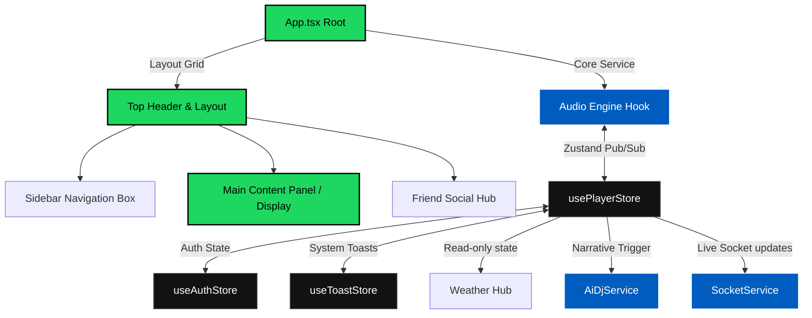
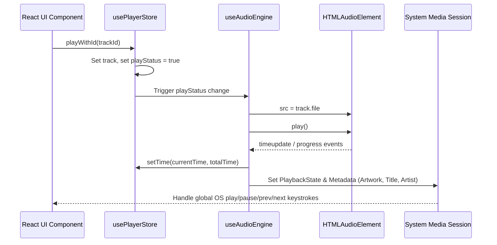

# 🏛️ Architecture & System Design Guide

This document describes the high-performance system design, data flows, state management, and key architectural choices driving the **Spotify Elite** codebase.

---

## 🧭 System Topology & Service Layer

Spotify Elite follows a decoupled, single-responsibility architecture built around four core pillars:
1. **Surgical State Container (Zustand)**: Serves as the global reactive data broker.
2. **Audio Engine Singleton (`useAudioEngine`)**: Manages HTMLAudioElement hooks, Media Session handshakes, and raw frequency telemetry analysis.
3. **Decoupled API Service Layer**: Stateless singletons managing authentication, weather fetching, socket connections, and AI DJ semantic narration.
4. **Hardware-Accelerated UI Panels**: GPU-bound React layout layers that render dynamic components.

---

## 💾 Reactive State Architecture (Zustand)

Global state is managed by a centralized, persistent Zustand store (`usePlayerStore.ts`). 

### Key Engineering Optimizations:
- **Hydration Minimization**: We use the `partialize` middleware option to cherry-pick which attributes are saved in local storage (e.g. `likedSongs`, `volume`, `history`, `showFriendActivity`), preventing dirty or massive state hydration on initial load.
- **Surgical Selectors**: Components utilize precise selectors (e.g., `const track = usePlayerStore(state => state.track)`) rather than pulling the whole store object, bypassing unnecessary React parent re-renders.

---

## 🎵 Custom Web Audio Engine

The application orchestrates audio via a strict singleton wrapper.

### Technical Highlights:
1. **Dynamic Frequency Telemetry**: Hooks into a `Web Audio API AnalyserNode` to extract real-time audio frequencies, feeding our clean, fast 60FPS WebGL/Canvas visualizer.
2. **OS Media Session Binding**: Registers OS hooks (`navigator.mediaSession`) so users can use physical keyboard media keys, earphone touch controls, and locking screens to command tracks.
3. **Decoupled Progress updates**: Active progress calculation is bound to a CSS variable (`--player-progress`) written directly to the DOM, fully escaping React's rendering lifecycle during high-frequency slider updates.

---

## ☁️ Contextual Weather Telemetry & AI DJ

Spotify Elite implements a unique **Atmospheric Music Sync Engine**.

- **Atmospheric Collection Hook (`useWeather`)**: Automatically gathers browser coordinates and hits OpenWeather API, populating the player store with condition telemetry.
- **Semantic Vector Mapping (`AiDjService.ts`)**: Narrates track transitions using GPT-grade local context assembly. When the DJ overlay is active, the engine cross-references the track genre against current environmental metrics (e.g., rainy, sunny, freezing) to build rich context, feeding browser speech synthesizers (`SpeechSynthesisUtterance`) to voice-narrate smart transition introductions!

---

## 👥 Real-Time Social Hub (WebSocket)

The "Friend Activity" social bar matches high-scale Spotify enterprise operations:
- **Decoupled Socket Singleton (`SocketService.ts`)**: Manages single-socket connection instances, registering lightweight event handlers.
- **Automatic Sync Hooking**: Dispatches custom `SOCIAL_UPDATE` signals whenever a user changes track, immediately notifying listening channels.
- **Transactional Sessions**: Allows active listeners to instant-sync their queues and progress bars (`playWithId`) with online friends.

---

## 🚀 Key Architectural Guidelines

1. **Keep Services Stateless**: Services (`AiDjService`, `SocketService`, `SpotifyAuthService`) must remain stateless singletons. Store all persistent conditions in Zustand stores.
2. **Strict Component Isolation**: UI components inside `src/components/ui/` must remain purely presentation-driven, receiving properties and delegating actions via callbacks, ensuring 100% testability.
3. **Types Over Casts**: Never utilize type-casting (`as any`) except when interfacing with third-party, non-typed Web Audio API nodes. Keep `/src/core/types.ts` strictly updated.
