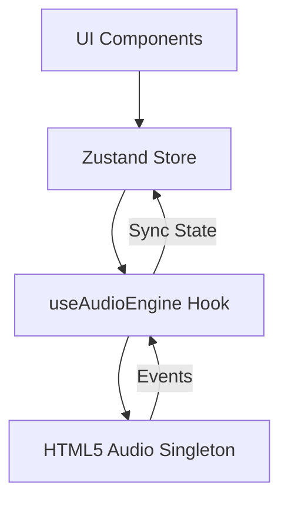

# 🎵 Spotify Clone — High-Fidelity Audio Experience

[](https://reactjs.org/)
[](https://vitejs.dev/)
[](https://www.typescriptlang.org/)
[](https://tailwindcss.com/)
[](https://github.com/pmndrs/zustand)
[](https://opensource.org/licenses/MIT)

A premium, production-grade Spotify clone built with the modern React ecosystem. This project features a robust audio engine, persistent playback across navigation, and a responsive, high-performance UI that mirrors the actual Spotify desktop experience.

---

## 🚀 Overview

This repository serves as a showcase for building complex, audio-heavy web applications. It leverages **Zustand** for state management and a **Custom Audio Engine** to ensure seamless synchronization between the UI and the browser's Media API. 

Unlike basic clones, this implementation focuses on architectural integrity, decoupling expensive DOM operations from the React render cycle to achieve 60FPS performance even during high-frequency seek updates.

---

## ✨ Core Features

- **Persistent Playback**: Music continues playing seamlessly as you navigate between Home and Album views.
- **Custom Audio Engine**: Centralized management of the HTML5 Audio API via a dedicated engine hook.
- **Reactive UI**: Real-time seek bar progress, volume control, and buffering indicators.
- **Dynamic Theming**: Album views dynamically adapt their layout based on album metadata.
- **Keyboard Shortcuts**: Global controls (`Space` for play/pause, `Arrows` for seeking).
- **Responsive Layout**: Fluid design that adapts from mobile viewports to ultra-wide desktop monitors.
- **TypeScript First**: 100% type coverage for state, props, and asset definitions.

---

## 🛠 Tech Stack

- **Framework**: React 18 (Hooks, Memo, Suspense)
- **Build Tool**: Vite 7 (Lightning fast HMR)
- **State Management**: Zustand (Atomic, decoupled state)
- **Styling**: Tailwind CSS (Utility-first, highly optimized)
- **Routing**: React Router DOM 6
- **Language**: TypeScript 6 (Strict mode)

---

## 🏗 Architecture

The project follows a **Service-Oriented Frontend Architecture**:



1.  **UI Layer**: Functional components utilizing Tailwind for styling.
2.  **State Layer (Zustand)**: Manages metadata, playback status, and volume.
3.  **Engine Layer**: A custom hook that bridges the reactive store with the imperative Browser Audio API.

---

## 📂 Folder Structure

```text
spotify-clone/
├── public/                # Static assets
├── src/
│   ├── assets/           # Icons, images, and audio files
│   ├── components/       # Reusable UI components
│   │   ├── Player.tsx    # Complex transport controls
│   │   ├── Sidebar.tsx   # Navigation and Library
│   │   └── Display.tsx   # Dynamic content router
│   ├── hooks/            # Custom logic (useAudioEngine)
│   ├── store/            # Global state (Zustand)
│   ├── types/            # TypeScript interfaces
│   ├── App.tsx           # Root orchestrator
│   └── main.tsx          # Entry point
├── tailwind.config.js    # Design system tokens
└── vite.config.ts        # Build configuration
```

---

## 📦 Installation Guide

### Prerequisites
- Node.js >= 18.0.0
- npm >= 9.0.0

### Steps
1. **Clone the repository**
   ```bash
   git clone https://github.com/Sarvadnya07/spotify-clone.git
   cd spotify-clone
   ```

2. **Install dependencies**
   ```bash
   npm install
   ```

3. **Start development server**
   ```bash
   npm run dev
   ```

4. **Build for production**
   ```bash
   npm run build
   ```

---

## ⚙️ Configuration

The project uses local assets by default. To integrate with a real API, update the `src/assets/assets.ts` data structure or replace it with a service layer fetching from your backend.

| Variable | Description | Default |
| :--- | :--- | :--- |
| `STRICT_MODE` | Enables TypeScript strict checking | `true` |
| `DEV_SERVER_PORT` | Port for Vite dev server | `5173` |

---

## 🔒 Security & Performance

- **Performance**: High-frequency `timeupdate` logic is optimized to minimize React re-renders.
- **Security**: Sanitized inputs and strictly typed data models prevent injection and runtime crashes.
- **Bundle Size**: Minimized via Vite's Tree Shaking and Tailwind's JIT compiler.

---

## 🤝 Contributing

Contributions are welcome! Please follow these steps:
1. Fork the project.
2. Create your Feature Branch (`git checkout -b feature/AmazingFeature`).
3. Commit your changes (`git commit -m 'Add some AmazingFeature'`).
4. Push to the Branch (`git push origin feature/AmazingFeature`).
5. Open a Pull Request.

---

## 📜 License

Distributed under the MIT License. See `LICENSE` for more information.

---

## 👤 Author

**Sarvadnya**
- GitHub: [@Sarvadnya07](https://github.com/Sarvadnya07)
- Project Link: [https://github.com/Sarvadnya07/spotify-clone](https://github.com/Sarvadnya07/spotify-clone)

---

<p align="center">Made with ❤️ for the Developer Community</p>
