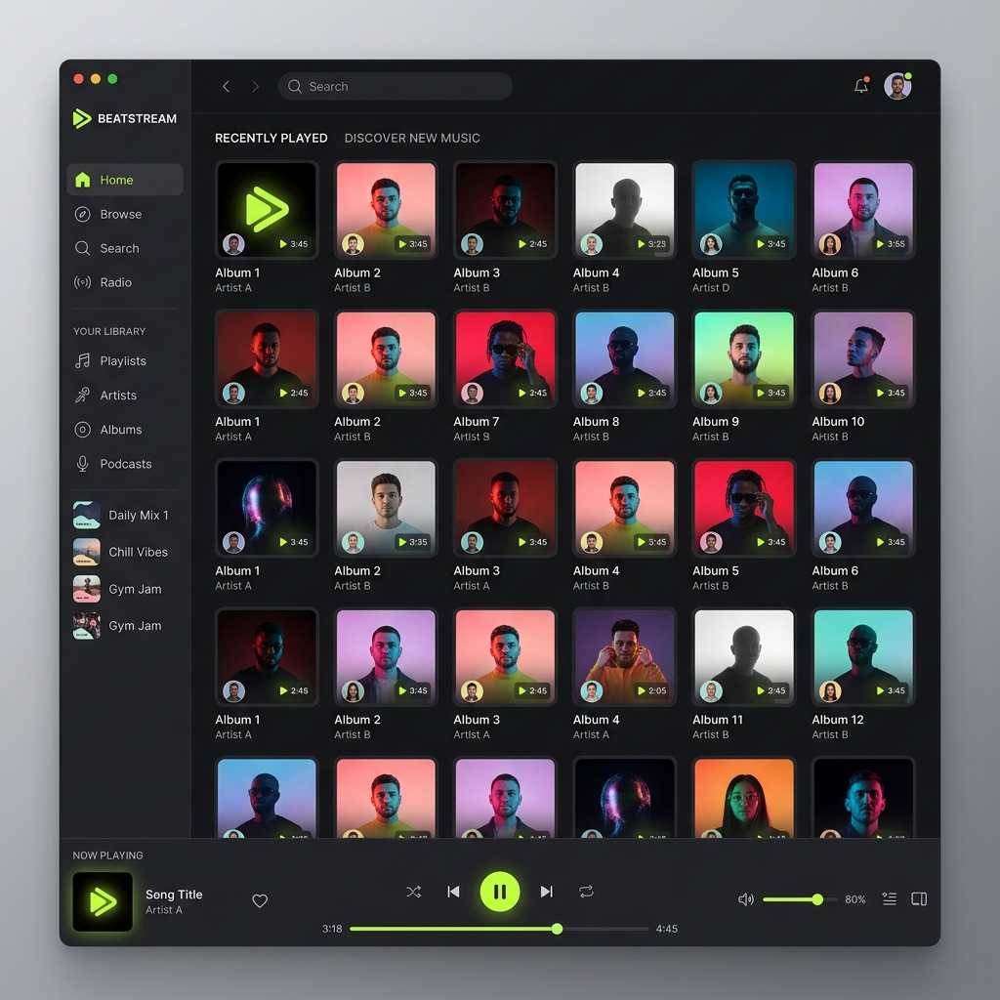

# 🎵 Spotify Clone — Premium Music Streaming UI


A high-fidelity, lightning-fast music streaming interface built with **React 18** and **Vite**. This project replicates the core Spotify experience, focusing on seamless audio playback, dynamic UI state management, and a premium developer experience.

---

## 📸 Preview



*Modern, responsive, and pixel-perfect UI designed for the ultimate listening experience.*

---

## 🌟 Key Features

- **⚡ Instant HMR:** Developed with Vite for near-instant Hot Module Replacement, ensuring a fluid development workflow.
- **🎧 Seamless Audio Player:** Integrated with **Context API** for global audio state management, preventing playback interruptions during navigation.
- **🎨 Modern Aesthetics:** Built using **Tailwind CSS**, featuring dark mode, glassmorphism effects, and smooth transitions.
- **🧭 Dynamic Routing:** Leverages `react-router-dom` for deep linking and smooth transitions between Home, Albums, and Artists.
- **📱 Fully Responsive:** Optimized for all devices, from desktop monitors to mobile screens.
- **🛠️ Production-Ready Architecture:** Clean, modular component-based structure optimized for scalability.

---

## 🛠️ Tech Stack

- **Framework:** [React 18](https://reactjs.org/)
- **Build Tool:** [Vite](https://vitejs.dev/)
- **Styling:** [Tailwind CSS](https://tailwindcss.com/)
- **State Management:** [React Context API](https://reactjs.org/docs/context.html)
- **Routing:** [React Router Dom v6](https://reactrouter.com/)
- **Linting & Formatting:** ESLint & Prettier

---

## ⚙️ Quick Start

### 1. Clone & Install
```bash
git clone https://github.com/Sarvadnya07/spotify-clone.git
cd spotify-clone
npm install
```

### 2. Run Development Server
```bash
npm run dev
```

### 3. Build for Production
```bash
npm run build
npm run preview
```

---

## 📂 Project Structure

```plaintext
spotify-clone/
├── public/                 # Static assets & Audio files
├── screenshots/            # Project preview images
├── src/
│   ├── assets/             # Global icons & imagery
│   ├── components/         # Reusable UI (Navbar, Sidebar, Player, etc.)
│   ├── context/            # Global state (PlayerContext)
│   ├── App.jsx             # Main Application layout
│   ├── main.jsx            # Entry point
│   └── index.css           # Global Tailwind styles
├── tailwind.config.js      # Tailwind customization
└── vite.config.js          # Vite configuration
```

---

## 🎯 Future Roadmap

- [ ] **Backend Integration:** Connect with Spotify API or Supabase.
- [ ] **Auth System:** User login and personalized profiles.
- [ ] **Social Features:** Collaborative playlists and friend activity.
- [ ] **PWA Support:** Installable app for mobile and desktop.
- [ ] **Visualizer:** Real-time audio frequency visualizer using Canvas.

---

## 📜 License

Distributed under the MIT License. See `LICENSE` for more information.

---

## 👨‍💻 Author

**Sarvadnya**
- GitHub: [@Sarvadnya07](https://github.com/Sarvadnya07)

---

*Show your support by giving this project a ⭐!*

